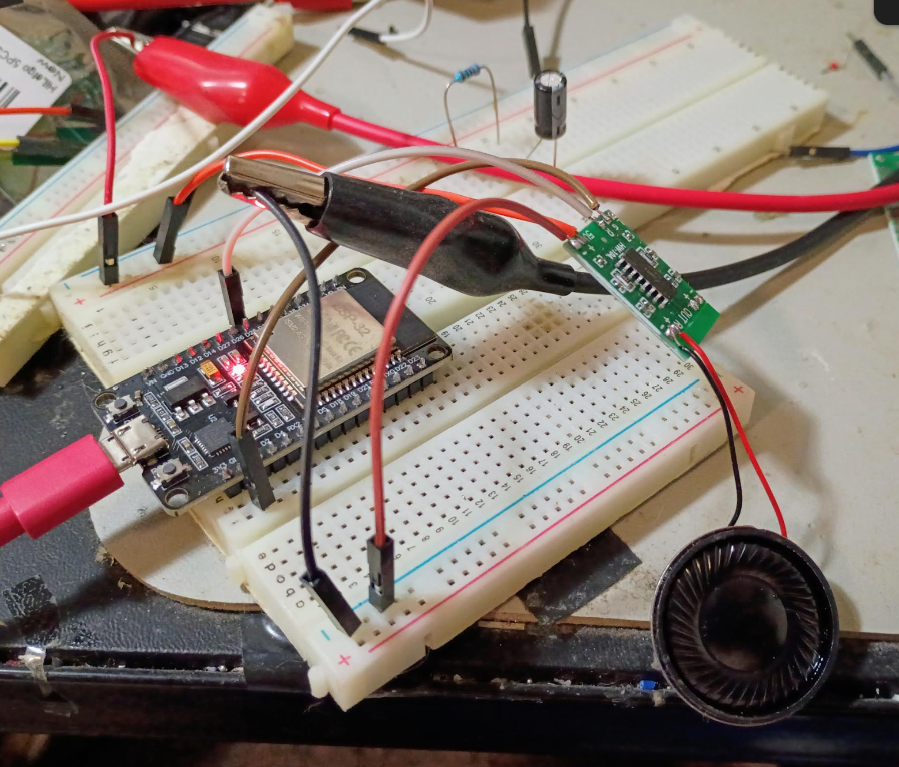
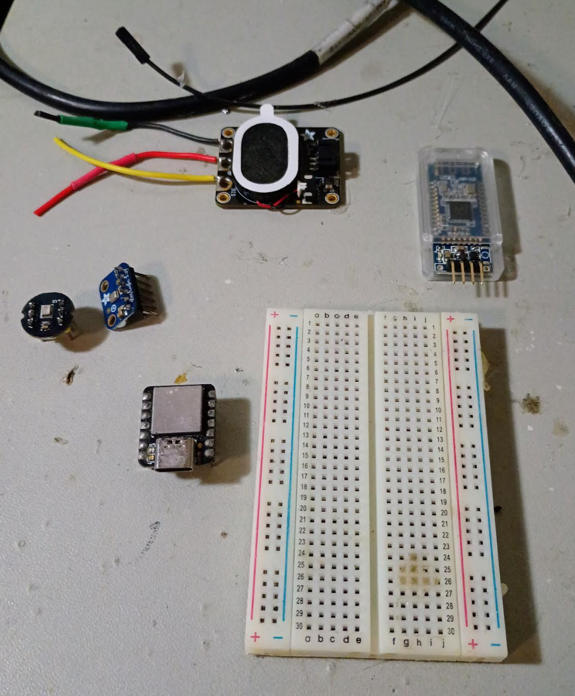

Tasks

- [ ] interface with BLE
  - phone
  - phone app
  - seeeduino
- [ ] record sound from mic
- [ ] store audio from mic
- [ ] playback audio

### 04/04/2026

10:56 AM

Back on, working on the mic right now while I wait for the DAC

11:13 AM

Cool got a working mic with Atomic14's code

I feel like I can just plug it into the a2dp code and verify by recording a video on my phone no mobile app needed

12:06 PM

Okay... so I guess that makes sense, if you use the ESP32 as a source, phone can't find it since phone isn't a sink (lol)

I'm not sure how to send mic data bidirectionally

12:12 PM

Damn... okay yeah this won't work, A2DP is designed for sending audio one way

What I'm after is hands free profile, it's different

Will need to do more research

---

### 04/03/2026

Funny I'm looking at this ESP32 module I'm like great wtf do I do now

9:40 PM

I'm looking at this so far it looks stright forward

https://github.com/pschatzmann/ESP32-A2DP

But I haven't produced sound yet, what I'm wondering about is the mic too how do I take the mic sound send it through BT to the phone

9:44 PM

Wow this ESP32 library is massive for Arduino IDE, just waiting here for stuff to install

9:51 PM

Added these two libraries by zip into Arduino IDE

https://github.com/pschatzmann/arduino-audio-tools

https://github.com/pschatzmann/ESP32-A2DP

10:06 PM

Driver problem

10:10 PM

Alright found the driver from silicon labs

Device manager, find the CP210x driver thing, select it, update driver, point it to the extracted driver

11:13 PM

So I've been playing around with this for a bit

It's pretty amazing you just flash this and the bluetooth works, it's putting audio out

The problem is the static damn...

Even had me put together a crude RC filter

But I think there's something else... I am using an amp it's the PAM8493

I'm not sure if my speakers are too puny/this amp is too powerful... but driving the speakers directly also sounds terrible

So it must be the internal DAC is not good... I need to use another way to drive the speakers if possible

11:40 PM

Well... I ordered some DACs PCM5102 (a) which only because I want them tomorrow

Although I'm not sure what time tomorrow they'll get in

There's something about jumpers I gotta look at

But I'll work on the mic stuff while I wait for that DAC

---

### 04/02/2026

12:42 AM

Doing some reading while watching TV

So yeah the Seeeduino is not gonna cut it

I ordered some ESP32s that have DACs and will do a2dp to stream audio from BT to speakers

Also got these amps

Once all this is wired together/working I'll design a box for it with the two speakers and single mic extending so they can be put inside a helmet

---

### 04/01/2026

10:37 PM

Pretty late but I wanted to do something

I ordered two differnt I2S mics:

- INMP441
- SPH0645LM4H

From an online YouTube sample, they both sound pretty similar

The former though is way cheaper, I got 5 of them for the same price as 1 of the other one which is an Adafruit board

I am using a Seeeduino currently one of the microcontrollers I have on hand

I have a bluetooth module this one is BLE iBeacon HM-10

Looks very basic 4 pins, Tx Rx and Power/Ground

I have not developed a mobile app yet that connected to a bluetooth device so that'll be good to get down

I'll be using React Native and Android

Oh and I also have an Adafruit speaker 3 wire type

Today I'm mostly doing some initial poking around

I'm going to solder the pins on two mics so I can put em on a breadboard

Also try and setup my Arduino programming environment

10:54 PM

It's crazy the INMP441 has like no parts to it, it has the mic and a resistor or maybe diode and a capacitor.

This bluetooth module may not be enough for what I need (audio)

Will see, I'm also thinking of adding button(s) and LEDs to the breadboard to have something to use to command stuff

Like "hold down" to record or something

LED may be extra since I can see the output in Arduino maybe

10:59 PM

Okay I need to charge this laptop

Got everything soldered so I can connect it to a breadboard, now to see what pins go where

I do need to test program this Seeduino real quick

11:09 PM

Oh right nRF connect nice

11:11 PM

Oh damn... that was cool, connected it to 5V

Flashing red light, scan for it with nRF app, connected, solid red

11:38 PM

I'm done for now, some good progress though

I found these small momentary switches would be good for the on-off, maybe a single tactile button for programming and a status LED

Has to be (relatively) waterproof

