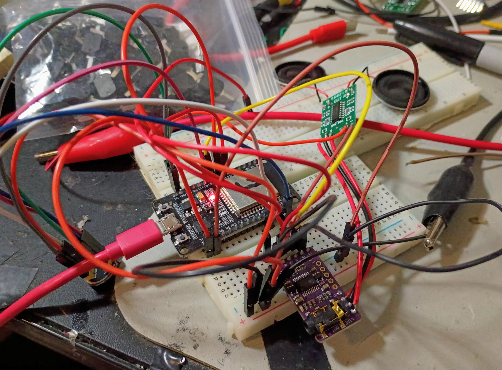
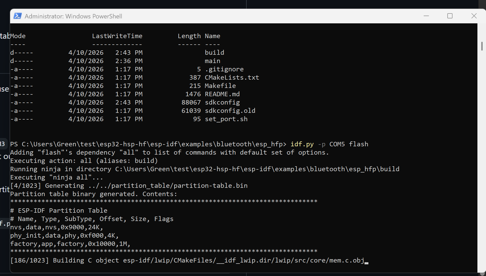
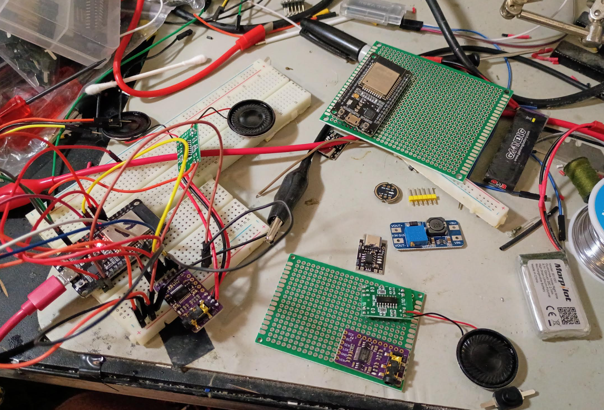
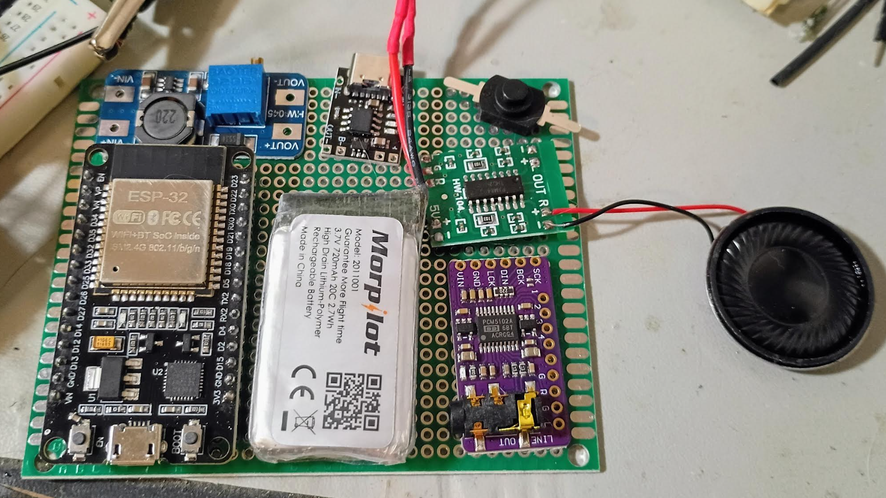

Tasks

- [ ] get HFP profile working
- [ ] assemble hardware

### 04/10/2026

1:06 PM

Alright took a half day at work, back on this

1:11 PM

Got the mic wired on based on atomic14's test code which worked in the past (serial plotter responding)

1:21 PM

I cloned this code and I'm reading through it at least it's in C so I can understand it

https://github.com/atomic14/esp32-hsp-hf/tree/main

I didn't want the WiFi part so I was looking into that

Right now I just want to get his code working, bind it to my pins

1:24 PM

Funny I was trying to run it in Arduino like nope... use that Makefile boy

1:30 PM

One problem I see with this code is the mac address being hardcoded, that won't fly

Probably need to do some kind of handshake/binding thing on first connection

I'll need to see if say with the nRF app if I can get a mac address

I'm not sure if this code is refering to the laptop's mac address or the BT mic's mac address

1:34 PM

Doing the ESP-IDF install

1:47 PM

Going through ESP-IDF installation

Looking at the sdkconfig file looks like it does have wifi

I'm still stuck on that mac part... I don't get why if it's for the mic/speaker itself then shouldn't that be arbitrary/your choice... it seems like you're picking the phone/computer's mac address

1:52 PM

It seems I can flash a program through Arduino on the STM32 to dump its BT mac address

1:53 PM

Says ESP-IDF successfully installed... I feel like it opened Powershell but it was blank... closed that window and the installation window said "finished install..." hmm.

I still have to do the bluekitchen part

Let me do this mac address real quick

Yes sir I got it... nice, I'll just mark the STM32's with 1 and 2 to keep track

2:02 PM

Man this documentation is not great sorry to say but still a good resource, hopefully I can piece this together

I have a feeling I could do it vs. pretty much impossible kind of thing

2:07 PM

So I cloned the esp-idf repo in the root directory of atomic14's repo so main and esp-idf are same level

I used a .exe installer to do the esp-idf part, that doesn't seem correct

I try to run the ./export.sh shell command says I need to install

Try to run the install shell command, crashes the VS code terminal nice

2:09 PM

Okay I'm gonna try and use powershell to run the install.ps1 as admin, don't know if you need to be admin but I'll do it

Yeah I've seen this error before "running scripts disabled on this system"

2:13 PM

That's installing, this is my hardware setup right now btw, once I get this to work eg. I could call somebody and talk to them on it

I'll actually solder it together along with the switch, boost converter, bms and rechargable battery.

2:21 PM

Interesting it says "All done you can now run export.ps1"

Cool now says I can now compile ESP-IDF projects

Oh... so maybe maybe the root folder of atomic14's repo is the "project" folder to run make in

unless... I put it inside a project folder in esp-idf... will find out

2:28 PM

I don't have make, from what I can tell atomic14's stuff was made in unix/non-windows although in some comments he's got a capital /Users/... directory pattern suggesting windows

Anyway installing make with chocolatey

Well past that part... now don't know where I'm supposed to actually run make

2:34 PM

Okay I'm continuing along with the steps here

https://github.com/espressif/esp-idf?tab=readme-ov-file#configuring-the-project

So maybe this is where you inject atomic14's code?...

okay yeah looking at one of the example projects it has a similar structure regarding CMakeLists.txt and main folder

2:37 PM

Ooh it's doing stuff

2:39 PM

Dude no way... maybe I have it already...

Still cloning submodules... what I kind of skipped/didn't do anything on is the bluekitchen part... will see

Maybe it's already done/included in atomic14's code

2:46 PM

Ooh it says configuration done... will it work or am I missing a bunch of stuff still?

2:48 PM

Here we go please work... lol

2:50 PM

Ooh I got scared, it was stuck on this line for a bit

`[428/1023] Building C object esp-idf/soc/CMakeFiles/__idf_soc.dir/esp32/gpio_periph.c.obj`

Stuck on this one too

`[533/1023] Building C object esp-idf/spi_flash/CMakeFiles/__idf_spi_flash.dir/esp_flash_api.c.obj`

It's weird the moment I copy it by right-clicking, moves forward

2:54 PM

No....

`fatal error: hci.h: No such file or directory`

2:56 PM

Adding this

REQUIRES bt to endo f CMakeLists.txt idf_component_register argument

Did not fix it

Okay it looks like that file comes from bluekitchen so yeah I do need to do that... but how...

3:00 PM

What's interesting is btstack has the same structure regarding CMake... main...

3:07 PM

I was looking through the kitchen repo and I think I know what I have to do, I have to include the 32 port thing as this project gets built

3:21 PM

Failing... I set the env in powershell but idf.py build doesn't see it...

It seems I could move the atomic14 code into btstack esp32 port folder since there is the "project skeleton" folder

3:23 PM

Alright made a new folder in there and building...

3:30 PM

Damn it still can't find hci.h

3:37 PM

(Fahhhhh sound effect)

Damn... still stuck

3:41 PM

From the CMakeLists.txt I can see the IDF path set in there... which mine doesn't match atomic14 but I corrected it

So it seems you run `idf.py build` in the root of atomic14 repo... but still not sure what to do about btstack

3:48 PM

Lmao you tease... counting up to 1300 build steps... FAILURE!!!

3:50 PM

I know there is literally a note that says "do not copy" lmao but I'm gonna try it (move btstack into esp-idf)

Nope still can't find hci.h damn, it's in the btstack folder, trying to figure out how to include it in the build

4:00 PM

I saw something where you run esp-idf set-target and it resets sdkconfig so it seems you are supposed to run the idf.py build command at this repo's root path eg. same level as main folder

btstack is in the esp-idf components folder... so I don't know why it's not being included in the build

4:10 PM

Ugh... I completely f'd it, let me start over, re-clone stuff fresh

I think I'll clone esp-idf by itself, get that setup

Then I'll clone the btstack repo and in there clone the atomic14 repo which I believe is/as probably mentioned, based on the sample project folder in the esp32 port

Which it's alright I just need to bring over the MAC address I found

4:29 PM

Back on... was waiting for the download seems I got throttled, had to try again

Was also daydreaming about actually assembling this hardware

I figure I'll socket the ESP32 but not the rest of the components.

Some will just be sitting ontop of a non-conductive layer like the charging board

Still not compiled

4:44 PM

So I git cloned esp-idf into its own folder

Did the install.ps1 and export.ps1 scripts

Cloned btstack into its own folder

Cloned atomic14 hfp repo into btstack/port/esp32

Then got the MAC address for the STM32 BT, updated `hfp_hf_demo.c` constant as noted in atomic14 repo

Update path in CMakeLists.txt (one outside of main) to reflect esp-idf path

set idf target to esp32 although it's correctly guessed

That initializes the submodules (wait)

4:53 PM

OMG... after all that, same problem lmao hci.h

5:52 PM

I've made some progress, a new error!

Priv requires esp_driver_gpio

I did that

5:57 PM

And another esp_driver_uart

Sitting here doing component layout as I try builds over and over

Not worried about cases right now, just make it work

Push-lock on-off button top right

3 of these components are mostly 1-sided so they'll just sit on a non-conductive pad of double-sided foam tape, with hotglue to secure em in place

6:04 PM

SHhhhiiiiiiiiiiii

i2s legacy... I probably should have considered cloning the same version stuff he used 4 years ago

Yeah... I think I have to do that... vs. trying to patch things... there is a migration guide apparently

---

### 04/09/2026

7:43 PM

Doing some research, I'm a bit distracted working on putting Debian 12 on this ASUS Eee PC 900A

So this is still hard... and the thing cannot be button push based

Some terms I've found

bluetooth hands-free profile

esp32 idf

8:19 PM

Damn... we got lucky

https://github.com/atomic14/esp32-hsp-hf

This looks like exactly what I need, this is primarily speech oriented not music so it's okay if it's not amazing sound

It could be made better if it's not much more work

I'm trying to get this done by this weekend and I have to assemble two units which isn't too hard of work

10:10 PM

Side tracked by my agent gui project

So funny how easy it is to type on this SB3 vs. the ASUS 900 Eee PC

Anyway so the thing above is not as straightforward as I thought, although it is a great resource/shows me that it is possible

I just need to put more time into it, I'm not interested in the wifi/mic only aspect

I need that POS demonstrated that was used for a phone call that works for my use case and also more intuitive to connect to BT than WiFi

---

### 04/08/2026

7:52 PM

Back on late start

Working on connecting the external DAC (PCM5102A)

8:29 PM

No sound yet... interesting the mic and speaker would share the same word select pin

9:08 PM

This guide worked

https://www.makerguides.com/audio-with-pam8403-pcm5102-and-esp32/

Nice clear sound damn

I still have to figure out the hands free profile part and I did test the mic connection, I saw a wave form in the serial plotter

I'll remeasure current draw later when the entire thing is put together but right now it was pulling over 100mA

That's 65% volume too from my Surface Book 3

---

### 04/04/2026

10:56 AM

Back on, working on the mic right now while I wait for the DAC

11:13 AM

Cool got a working mic with Atomic14's code

I feel like I can just plug it into the a2dp code and verify by recording a video on my phone no mobile app needed

12:06 PM

Okay... so I guess that makes sense, if you use the ESP32 as a source, phone can't find it since phone isn't a sink (lol)

I'm not sure how to send mic data bidirectionally

12:12 PM

Damn... okay yeah this won't work, A2DP is designed for sending audio one way

What I'm after is hands free profile, it's different

Will need to do more research

This right here was particularly interesting

https://github.com/pschatzmann/ESP32-A2DP/discussions/283

https://github.com/jokubasver/saab-93NG-bluetooth-aux/blob/master/esp32_a2dp_receiver/src/main.cpp

---

### 04/03/2026

Funny I'm looking at this ESP32 module I'm like great wtf do I do now

9:40 PM

I'm looking at this so far it looks stright forward

https://github.com/pschatzmann/ESP32-A2DP

But I haven't produced sound yet, what I'm wondering about is the mic too how do I take the mic sound send it through BT to the phone

9:44 PM

Wow this ESP32 library is massive for Arduino IDE, just waiting here for stuff to install

9:51 PM

Added these two libraries by zip into Arduino IDE

https://github.com/pschatzmann/arduino-audio-tools

https://github.com/pschatzmann/ESP32-A2DP

10:06 PM

Driver problem

10:10 PM

Alright found the driver from silicon labs

Device manager, find the CP210x driver thing, select it, update driver, point it to the extracted driver

11:13 PM

So I've been playing around with this for a bit

It's pretty amazing you just flash this and the bluetooth works, it's putting audio out

The problem is the static damn...

Even had me put together a crude RC filter

But I think there's something else... I am using an amp it's the PAM8493

I'm not sure if my speakers are too puny/this amp is too powerful... but driving the speakers directly also sounds terrible

So it must be the internal DAC is not good... I need to use another way to drive the speakers if possible

11:40 PM

Well... I ordered some DACs PCM5102 (a) which only because I want them tomorrow

Although I'm not sure what time tomorrow they'll get in

There's something about jumpers I gotta look at

But I'll work on the mic stuff while I wait for that DAC

---

### 04/02/2026

12:42 AM

Doing some reading while watching TV

So yeah the Seeeduino is not gonna cut it

I ordered some ESP32s that have DACs and will do a2dp to stream audio from BT to speakers

Also got these amps

Once all this is wired together/working I'll design a box for it with the two speakers and single mic extending so they can be put inside a helmet

---

### 04/01/2026

10:37 PM

Pretty late but I wanted to do something

I ordered two differnt I2S mics:

- INMP441
- SPH0645LM4H

From an online YouTube sample, they both sound pretty similar

The former though is way cheaper, I got 5 of them for the same price as 1 of the other one which is an Adafruit board

I am using a Seeeduino currently one of the microcontrollers I have on hand

I have a bluetooth module this one is BLE iBeacon HM-10

Looks very basic 4 pins, Tx Rx and Power/Ground

I have not developed a mobile app yet that connected to a bluetooth device so that'll be good to get down

I'll be using React Native and Android

Oh and I also have an Adafruit speaker 3 wire type

Today I'm mostly doing some initial poking around

I'm going to solder the pins on two mics so I can put em on a breadboard

Also try and setup my Arduino programming environment

10:54 PM

It's crazy the INMP441 has like no parts to it, it has the mic and a resistor or maybe diode and a capacitor.

This bluetooth module may not be enough for what I need (audio)

Will see, I'm also thinking of adding button(s) and LEDs to the breadboard to have something to use to command stuff

Like "hold down" to record or something

LED may be extra since I can see the output in Arduino maybe

10:59 PM

Okay I need to charge this laptop

Got everything soldered so I can connect it to a breadboard, now to see what pins go where

I do need to test program this Seeduino real quick

11:09 PM

Oh right nRF connect nice

11:11 PM

Oh damn... that was cool, connected it to 5V

Flashing red light, scan for it with nRF app, connected, solid red

11:38 PM

I'm done for now, some good progress though

I found these small momentary switches would be good for the on-off, maybe a single tactile button for programming and a status LED

Has to be (relatively) waterproof

