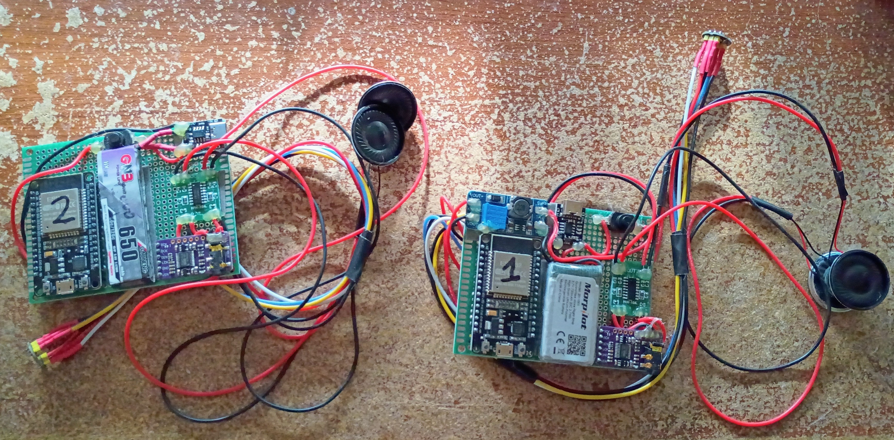
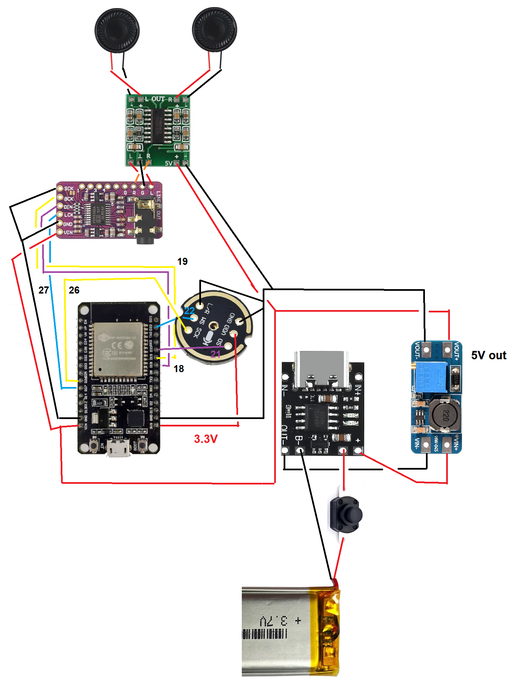

### About

This is for my friend's project. He's doing the software. Pretty much open source hardware and then software uses cellular to go from user to user.

While I was able to flash the code based on Atomic14's mods to the BlueKitchen BTStack HFP demo, I could not get the mic audio to show up in Audcaity, so I don't consider this a success.

Sorry this is pretty poor quality feeling lazy.

### Software notes

I built my stuff in Windows see the video on my Vanta Wing channel.

Atomic14's code is from 4-5 years ago as I write this, so that's Python 3.9 time. I version-locked relevant dependencies eg. cloned ESP-IDF version that was out at that time, same for the BlueKitchen BTStack repo and for the pkg_resources issue I capped the setuptools to 81.0.0 in esp-idf requirements.txt file.

I did the ESP-IDF install/export, cloned bstack, put atomic14's code in the examples folder (doesn't exist in modern btstack code).

Then I was able to build and flash from windows Powershell
